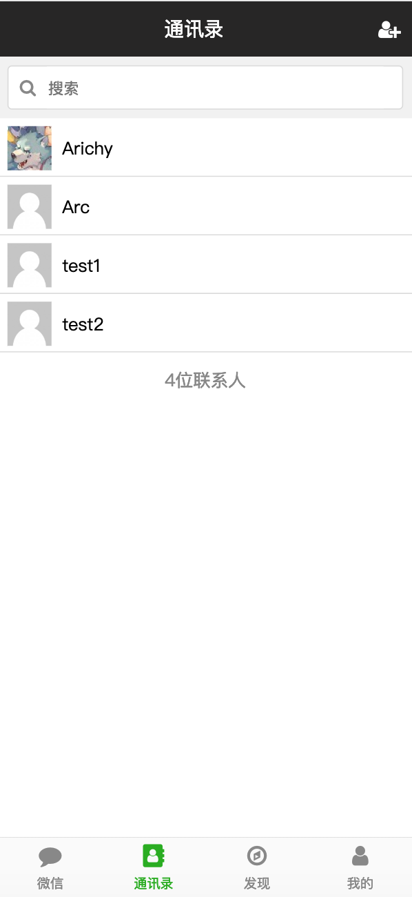

<h2>微信朋友圈</h2>
<h4>功能：</h4>
<ul>
    <li>注册、登陆</li>
    <li>发表朋友圈</li>
    <li>实时聊天</li>
</ul>

<h4>预览：</h4>
<ul type="none">
    <li>
    
注册

    
    </li>
    <li>
    
登陆

    
    </li>
    <li>
    
发现页

    
    </li>
    <li>
    
发表朋友圈

    
    </li>
    <li>
    
朋友圈

    
    </li>
    <li>
    
聊天

    
    </li>
    <li>
    
详细资料

    
    </li>
    <li>
    
通讯录

    
    </li>
</ul>